# 在PKE OS Lab中使用GDB调试

## 省流

[仓库](https://gitee.com/hustos/riscv-pke)里缺失的.gdbinit文件内容是:

```gdb
target extended-remote localhost:3333
symbol-file obj/riscv-pke
b m_start
c
```

官方docker镜像`apt update && apt install lsof libncurses5 libjim-dev libjim0.79 libpython2.7`装完依赖后就可以使用这几个命令连接至openocd调试. 但是给的gdb版本有点老, 建议更新一下

## 配置步骤

gdb调试pke相当于调试一个嵌入式设备, 这方面资料很多, 总体流程是这样的:

1. 安装工具链:  
    `spike`, `openocd`用[pke-doc](https://gitee.com/hustos/pke-doc/blob/master/chapter2_installation.md)那个就行, `riscv64-unknown-elf-gdb`建议从riscv官方仓库release下载
2. 启动spike:  
    `spike --rbb-port=9824 --halted obj/riscv-pke obj/app_errorline`
    (旧版本`--halted`是`-H`)
3. 启动openocd:  
    `openocd -f ./.spike.cfg`
4. 启动gdb:  
    - `riscv64-unknown-elf-gdb`启动
    - 之后在gdb命令行中`target extended-remote localhost:3333`连接到openocd
    使用`symbol-file obj/riscv-pke`载入调试符号信息
    - 正常打断点调试
        ```gdb
        b m_start
        c
        ```

## 坑点

1. spike会先从`0x1000`开始执行几条代码(并非elf入口点), 用来提供dtb相关信息, 这几条指令并不在elf文件中, GDB也无法感知, 因此gdb`load`命令会从`_mentry`开始执行, 此时`a0 a1`未初始化, 调试到init_dtb()就会炸;
2. 在启用timer后每次gdb step都会先进入中断处理, 可通过set $mie = $mie & ~0x80关闭MIE_MTIE
3. 工具链最好不要用发行版的, 虽然写了有riscv支持, 但是有点容易出兼容性问题, 最好去riscv官方仓库那里;
4. [pke-doc那个镜像](docker.io/tjr9098/amd64_pke_mirrors:1.0)的gdb工具链有点小小兼容性问题, 有些调试信息识别不了;

    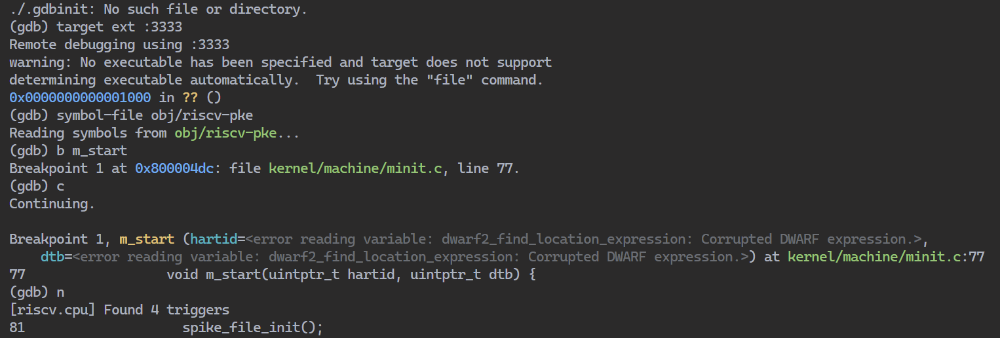
    
5. 从21年到现在spike的命令行参数(`-H` -> `--halted`)和openocd的配置文件格式有些小改, 需要稍微注意.

## 踩坑过程

1. 起初按照[GDB-and-OpenOCD](https://openocd.org/doc/html/GDB-and-OpenOCD.html)文档的20.2节进行调试:

    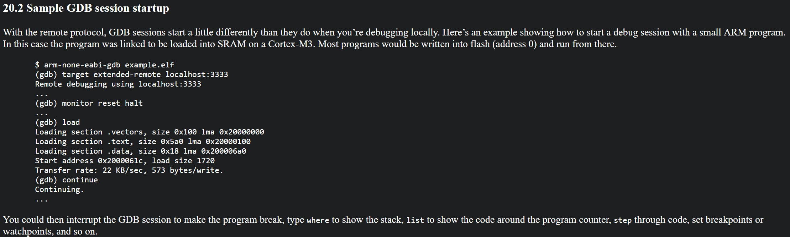

    `riscv64-unknown-elf-gdb`连接上openocd后:

    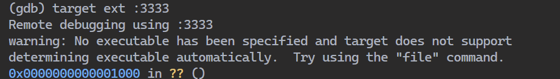

    并未察觉到0x1000地址的含义, 以为只是由于gdb"尚未感知"`obj/riscv-pke`导致的问题, 因此参考文档执行`load obj/riscv-pke`, 随后`$pc`变成了elf入口点(_mentry), 似乎一切正常.

    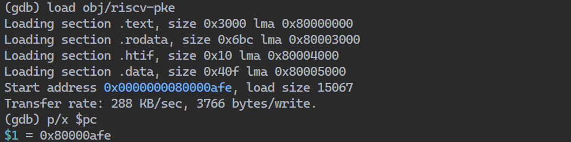

    然后发现执行到`init_dtb()`内的`fdt_scan()`时`$pc`突然变成0x0:

    

    
    
    
    
2. 想不明白, 开始排查:

    先把GDB去了, 用openocd调试看看, `$pc`依然是0x1000:
    
    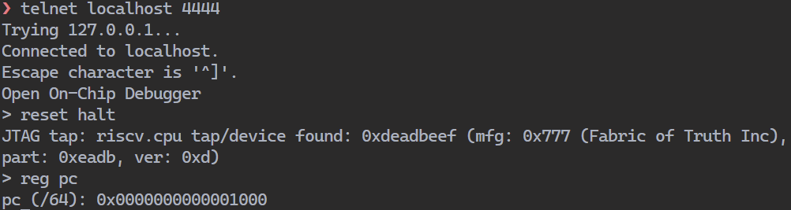
    
    打完断点, 单步之后依然复现:
    
    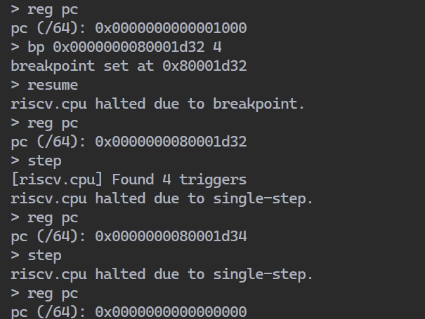

3. 终于注意到了0x1000, 查看spike的指令log:

    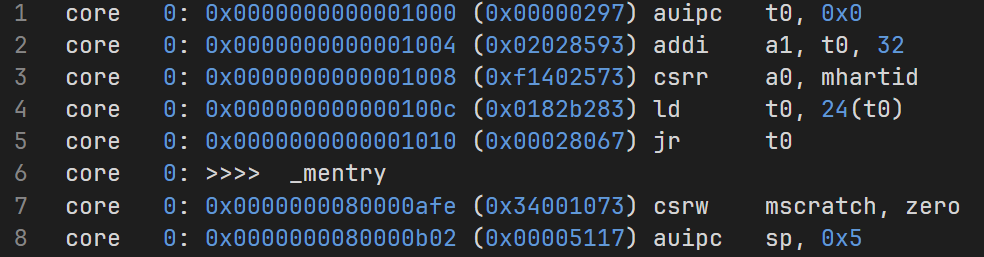
    
    查看spike源代码发现其加电后会在0x1000进行一些dtb之类的初始化, 然后跳转至入口点_mentry:
    
    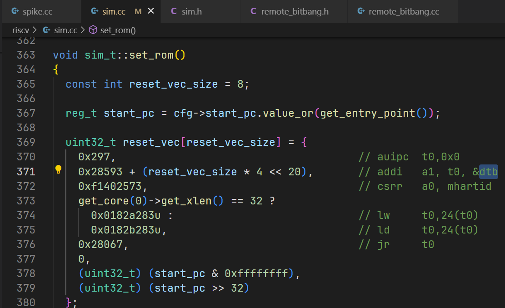
    
    即`void m_start(uintptr_t hartid, uintptr_t dtb)`的两个参数`a0 a1`
    
    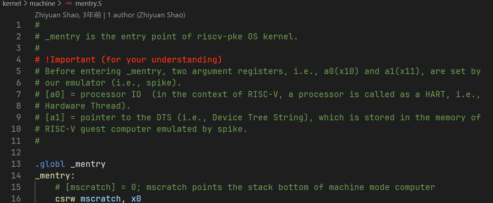

4. 原因分析:  

    通过`set debug remote 1`查看传输日志得知, gdb中`load`操作会将本地的`obj/riscv-pke`文件通过openocd传输至spike内存, 其实是重复操作, 而GDB `load`之后会根据elf文件将`$pc`设置为其中的入口点, 从而跳过了0x1000那段代码的执行, `a0 a1`未能初始化, 导致init_dtb()炸掉.
    ```
    (gdb) help load
    Dynamically load FILE into the running program.
    FILE symbols are recorded for access from GDB.
    Usage: load [FILE] [OFFSET]
    ```

5. 解决办法:  

    通过上面的过程可知, openocd具备完备的调试功能(断点/单步/内存查等), gdb不过是作为一个友好的接口(连接源代码/反汇编), 因此gdb只需要处理调试符号相关内容:
    ```gdb
    target extended-remote localhost:3333
    symbol-file obj/riscv-pke
    b m_start
    c
    ```

6. 开启timer后时钟中断影响调试:
    
    开启时钟中断前next能够正常执行, 开启后会进入中断处理, 且无法继续:
    
    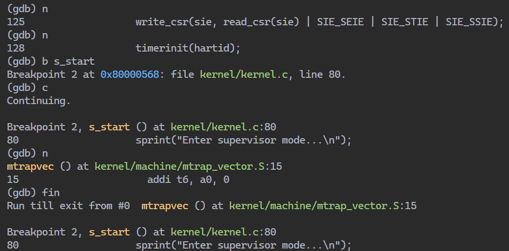
    
    `set $mie = $mie & ~0x80`关闭MIE_MTIE中断使能.
    

## 相关资源

1. [浙江大学24年秋冬操作系统实验(关于 spike 工具链的使用)](https://zju-sec.github.io/os24fall-stu/spike/)
2. [gdb target和load](https://sourceware.org/gdb/current/onlinedocs/gdb.html/Target-Commands.html)
3. [GDB-and-OpenOCD](https://openocd.org/doc/html/GDB-and-OpenOCD.html)
4. [VSCode调试时preLaunchTask为持续后台任务](https://github.com/microsoft/vscode/issues/90288)

## 附: 环境信息

- **系统**: Ubuntu 22.04.1 LTS
- **GDB**: riscv64-unknown-elf-gdb ([官方release](https://github.com/riscv-collab/riscv-gnu-toolchain/releases/tag/2025.01.20))
- **Spike**: [commit 206268c](https://github.com/riscv-software-src/riscv-isa-sim)
- **OpenOCD**: [commit fac1412](https://github.com/riscv-collab/riscv-openocd)
    ```
    adapter driver remote_bitbang
    remote_bitbang host localhost
    remote_bitbang port 9824
    
    set _CHIPNAME riscv
    jtag newtap $_CHIPNAME cpu -irlen 5 -expected-id 0x10e31913
    
    set _TARGETNAME $_CHIPNAME.cpu
    target create $_TARGETNAME riscv -chain-position $_TARGETNAME
    
    gdb report_data_abort enable
    
    init
    halt
    ```
    
## 附: VSCode配置

效果:

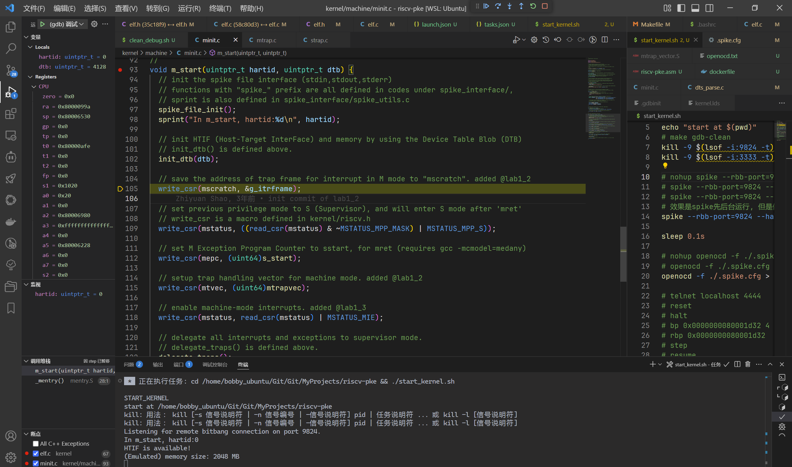

- **.vscode/launch.json**:
    ```json5
    {
        "version": "0.2.0",
        "configurations": [
            {
                "name": "(gdb) 调试pke",
                "type": "cppdbg",
                "request": "launch",
                "args": [],
                "stopAtEntry": true,
                // "stopAtConnect": true,
                "cwd": "${workspaceFolder}",
                "environment": [],
                "externalConsole": false,
                "MIMode": "gdb",
                "program": "${workspaceFolder}/obj/riscv-pke",
                "miDebuggerPath": "riscv64-unknown-elf-gdb",
                // "miDebuggerServerAddress": "localhost:3333",
                // "miDebuggerArgs": "obj/riscv-pke",
                // "useExtendedRemote": true,
    
                // riscv64-unknown-elf-gdb --interpreter=mi obj/riscv-pke
                // target extended-remote localhost:3333
                //
                "setupCommands": [
                    {
                        "description": "为 gdb 启用整齐打印",
                        "text": "-enable-pretty-printing",
                        "ignoreFailures": false
                    },
                    {
                        "text": "cd ${workspaceFolder}",
                        "ignoreFailures": false
                    },
                    {
                        "description": "target ext :3333, 连接至openocd",
                        "text": "target extended-remote localhost:3333",
                        "ignoreFailures": false
                    },
                    // {
                    //     "description": "发送`reset halt`命令至openocd复位, 并无必要",
                    //     "text": "monitor reset halt",
                    //     "ignoreFailures": false
                    // },
                    {
                        "text": "symbol-file obj/riscv-pke",
                        "ignoreFailures": false
                    },
                    // {
                    //     "text": "source ./.gdbinit",
                    //     "ignoreFailures": false
                    // },
                ],
                "preLaunchTask": "start_kernel.sh",
                // "postDebugTask": "clean_debug.sh",
    
                // 在调试控制台中显示详细log
                // "logging": {
                    // "trace": true,
                    // "traceResponse": true,
                    // "engineLogging": true
                // }
            }
        ]
    }
    ```
- **.vscode/tasks.json**:
    ```json5
    {
      "version": "2.0.0",
      "options": {
        "cwd": "${workspaceFolder}"
      },
      "tasks": [
        {
          "type": "shell",
          "label": "start_kernel.sh",
          "command": "cd ${workspaceFolder} && ./start_kernel.sh",
          "isBackground": true,
          "args": [],
          "group": {
            "kind": "build",
            "isDefault": false
          },
          "problemMatcher": [
            {
              "pattern": {
                "regexp": "^(START_KERNEL)", //问题模式或者所提供或预定义问题模式的名称。如果已指定基准，则可以省略。
                "line": 1
                // "file": 1,
                // "location": 2,
                // "message": 3
              },
              "background": { //用于跟踪在后台任务上激活的匹配程序的开始和结束的模式。
                "activeOnStart": true, //如KERNEL_STARTED果设置为 true，则任务启动时后台监视器处于活动模式。这相当于发出与 beginsPattern 匹配的行
                "beginsPattern": "^(START_KERNEL)", //如果在输出内匹配，则会发出后台任务开始的信号
                "endsPattern": "^(START_KERNEL)" //如果在输出内匹配，则会发出后台任务结束的信号
              }
            }
          ],
          "detail": "start_kernel.sh"
        }
      ]
    }
    ```
- **start_kernel.sh**

    ```bash
    #!/bin/bash
    
    echo "START_KERNEL"
    
    echo "start at $(pwd)"
    # make gdb-clean
    kill -9 $(lsof -i:9824 -t)
    kill -9 $(lsof -i:3333 -t)
    
    # spike -l --log=spike.log obj/riscv-pke obj/app_errorline
    # 效果是spike先后台运行, 但是依然显示spike的输出
    spike --rbb-port=9824 --halted obj/riscv-pke obj/app_errorline 2>&1 | tee spike.log &
    
    sleep 0.1s
    
    # openocd -f ./.spike.cfg -c "reset halt" 2>&1 | tee openocd.log
    openocd -f ./.spike.cfg > openocd.log 2>&1
    
    # telnet localhost 4444
    # reset
    # halt
    # bp 0x0000000080001d32 4
    # rbp 0x0000000080001d32
    # step
    # resume
    
    # riscv64-unknown-elf-gdb obj/riscv-pke -ex "target ext :3333" -ex "monitor reset halt" -ex "b m_start" -ex "c" -ex "layout src" -ex "focus cmd"
    
    echo STARTED
    ```
    
    